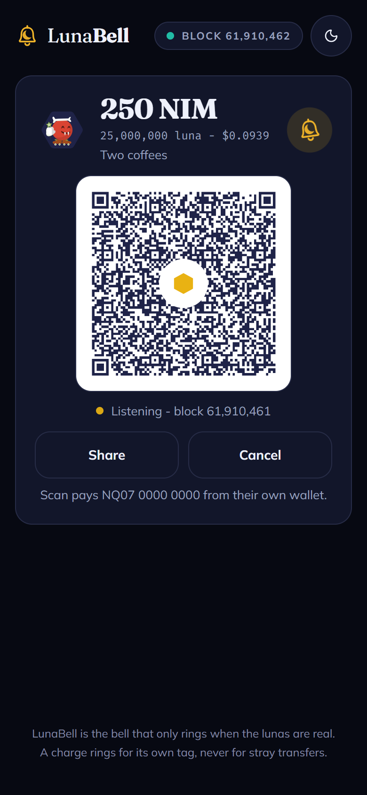
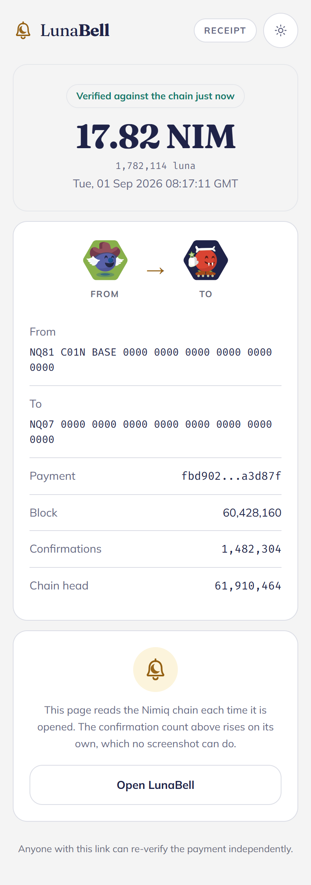

# LunaBell

**The bell that only rings when the lunas are real.**

### Someone says they paid.

Their phone says **Sent**.

You still do not know if the money arrived.

**LunaBell does.**

LunaBell is a Nimiq Pay Mini App that turns a phone into a payment soundbox. Create a charge, show the QR, and put the phone down. LunaBell watches for that exact payment on the Nimiq chain.

When it actually settles, **the bell rings.** It announces the amount out loud and opens a receipt that can be checked against the chain again later.

No screenshot to trust.
No account to create.
No database.
No custody of funds.

**Just the payment, verified on-chain.**

**[Live demo](https://lunabell.vercel.app)** · Built for the Nimiq Mini Apps Competition, Cycle II.

<p align="center">
  
</p>

---

## The problem

A payment screenshot proves almost nothing.

A customer can show a convincing "payment successful" screen and walk away before anyone has received a luna. That is why payment soundboxes became popular in markets such as India. Merchants interviewed by [*Rest of World*](https://restofworld.org/2023/india-digital-payments-sound-boxes/) (4 April 2023) named fake or doctored receipts as a reason they bought one. Paytm had deployed 6.8 million Soundboxes. PhonePe had 2.2 million Smart Speakers. Every one of them is a device you purchase.

The soundbox changes the question from "can I trust what you are showing me?" to **"did the payment actually arrive?"**

LunaBell is that device as free software, inside a wallet people already have.

Open it on a phone. Create a charge. Show the QR. Keep doing whatever you were doing.

When the real payment arrives, **the phone tells you.**

And because the receipt is tied to the transaction itself, anyone can open it later and check the chain again.

It is not only for a counter. A stall, a cafe, a freelancer, a roommate, anyone who has ever been told "I sent it" gets the same two things: a sound they can trust, and a receipt they can forward.

---

## See it in action

1. **Create a charge.** Enter an amount and an optional memo.
2. **Show the QR.** The payer scans it and pays from their own wallet.
3. **Put the phone down.** LunaBell waits for the actual transaction.
4. **The payment settles.** The bell rings and announces the amount.
5. **Verify it later.** The receipt reads the transaction from the chain again. Its confirmation count changes as the transaction gets deeper into the chain.

A screenshot cannot do that.

<p align="center">
  
</p>

---

## Why LunaBell is different

Most payment requests tell you how to **send** money.

LunaBell is about what happens **after someone says they sent it.**

A charge is bound to the recipient, the exact amount, a unique payment tag, and the block height when the charge was created. A payment only rings the bell when those conditions match.

That means an unrelated transfer, an old payment, an untagged transfer, or a tiny dust transaction cannot accidentally ring it.

There is no LunaBell account.
There is no LunaBell wallet.
There is no LunaBell database.

**The blockchain is the source of truth.**

---

## Built around Nimiq

LunaBell uses Nimiq Pay for the payment itself and reads the public Nimiq chain for verification.

The payer sends with `sendBasicTransactionWithData`, so the charge tag travels with the transaction. The receipt then reconstructs the payment from that transaction.

NIM is the native asset. Fees are zero. The Mini App never holds funds.

### What the verification claim actually is

The Nimiq Pay Mini App interface does not currently expose transaction watching or transaction lookup to Mini Apps. LunaBell uses `isConsensusEstablished()` as a safety gate, and reads transaction state through a public Nimiq RPC endpoint.

It does **not** claim to be a light client or an inclusion-proof system.

The claim is simpler: **when LunaBell says a payment arrived, it has matched that payment against the Nimiq chain.**

---

## More than a soundbox

Every confirmed ring is saved on the phone.

The day's takings screen shows total received today, individual payments, memos, timestamps, and transaction hashes. You can replay a previous announcement or speak the day's total aloud.

Nothing is sent to a LunaBell server.

<p align="center">
  
</p>

---

## Try it

**Live:** https://lunabell.vercel.app

Inside Nimiq Pay, LunaBell takes the receiving address from the host wallet.

Outside Nimiq Pay, it runs in browser preview so the flow can still be explored.

The fastest way to hear a real ring with one wallet:

1. Open the live URL on your phone.
2. Tap **Open in Nimiq Pay**.
3. Tap **Ring 1 NIM on this phone**.
4. Confirm the native sheet. The bell rings on a tagged mainnet payment to yourself.

Need about 1 NIM of dust. Fees are zero.

---

## The mark

A bell carrying a crescent: the bell that rings only when the lunas are real. One NIM is 100,000 luna, so the subunit is what the bell is listening for. It is drawn as geometry in `components/Logo.tsx` and holds its silhouette down to 16px.

Light is for a counter in daylight. Dark is for a counter at night. Gold is the colour of a struck bell.

---

## Technical notes

A **charge** is the only object in the app: an amount, a memo, a nonce, and the block height when it was created. It lives entirely in its own URL.

The payment tag is `LB:` plus the first 8 hex characters of `SHA-256(recipient|value|nonce)`. The watcher matches recipient, exact luna amount, tag, and a block at or after creation. `pnpm test` asserts the bell stays silent for a wrong amount, a wrong tag, a wrong recipient, an untagged transfer, a block older than the charge, and a failed execution.

Spoken amounts follow `window.nimiqPay.language`: English, German, Spanish, French, Portuguese, falling back to English.

The Mini App provider surface used here is `listAccounts`, `sign`, `isConsensusEstablished`, `getBlockNumber`, and the send methods.

### Hand off from another app

Any site, QR, or Mini App can open LunaBell with a charge already filled in:

```
https://lunabell.vercel.app/app?amount=12.5&unit=usd&memo=Table%204&to=NQ...
```

| Parameter | Meaning |
| --- | --- |
| `amount` | Digits, decimal point allowed |
| `unit` | `nim` (default) or `usd` `eur` `gbp` `brl` `inr` |
| `memo` | Shown to the payer, 60 characters |
| `to` | Receiving address. Ignored inside Nimiq Pay, which uses the wallet |

The payee still presses Listen, so a link can never start a charge silently.

### Install

The app ships a manifest and a network-first service worker, so it installs to a home screen and opens fullscreen on `/app`. The service worker never caches `/api/`, so chain reads stay live.

---

## Testing

```bash
pnpm install
pnpm dev
```

Open http://localhost:3000 for the landing page. The Mini App itself is at `/app`.

```bash
pnpm test    # charge, tag, and matcher rules
pnpm shots   # every screen in light and dark, needs a local server
```

See [TESTING.md](TESTING.md) for the full walkthrough: what can be checked without a wallet, and what cannot.

---

## Deploy

Vercel, zero configuration. No database and no environment variables are required.

[](https://vercel.com/new/clone?repository-url=https://github.com/AustinChris1/LunaBell)

```bash
npx vercel --prod
```

| Variable | Default | Purpose |
| --- | --- | --- |
| `NIMIQ_RPC_URL` | `https://rpc.nimiqwatch.com` | Nimiq mainnet RPC used by the watcher and receipts |

Point a Mini App at the deployed origin:

```
nimiqpay://miniapp?url=https%3A%2F%2Flunabell.vercel.app
```

The `https://nimpay.app/miniapps/open/lunabell.vercel.app` form only works once LunaBell is in the public directory (`nimiq/awesome`). Until then that page returns "Unknown mini app host". In-app **Open in Nimiq Pay** buttons use the same platform launches as the official site (`intent://` on Android, `nimiqpay://` on iOS) and do not depend on the directory.

---

## Layout

```
app/
  page.tsx            landing page, forwards to /app inside Nimiq Pay
  app/page.tsx        compose a charge, then listen
  pay/page.tsx        the payer view a shared link opens
  r/[txid]/page.tsx   the receipt, re-read from chain on every open
  api/watch           matches a charge against recent transactions
  api/tx/[hash]       a single transaction, for receipts
  api/price           NIM to fiat, for the spoken amount
lib/
  charge.ts           the charge object, its tag, and URL encoding
  nimiq-rpc.ts        RPC client and the matching rules
  speech.ts           the chime and the spoken announcement
```

## License

MIT. See [LICENSE](LICENSE).
